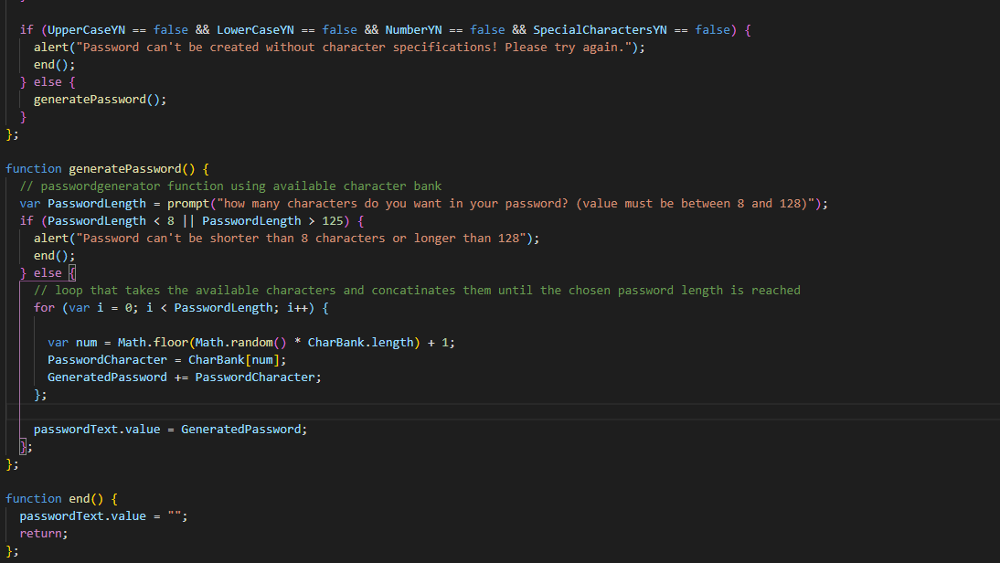

# Password Generator
---
    
## Description

Application that an anyone can use to generate a random password that provides greater security based on criteria they’ve selected. This app will run in the browser, and is responsive, ensuring that it adapts to multiple screen sizes.

## Usage

Click on generate password and a series of prompts will appear asking for criteria. 

* length (8-128 characters)
* Character Types (lowercase, uppercase, numeric, and/or special characters)
  
Once all prompts are answered and validated, the password is generated and displayed on the page

my input should be validated and at least one character type should be selected

## link
https://asante-rashid.github.io/hw3-password-generator/